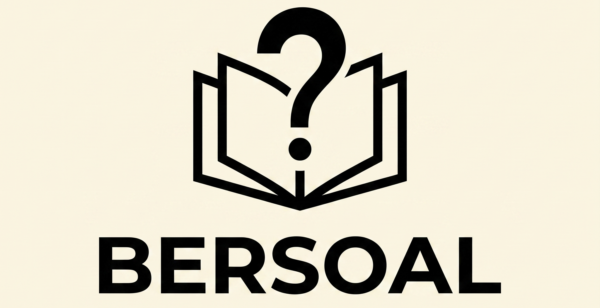

  
  <h1>BERSOAL - Evaluasi Pembelajaran (HOTS AI Generator)</h1>
  

    <strong>Platform Edutech berbasis AI untuk menyusun instrumen evaluasi HOTS (Higher Order Thinking Skills) yang selaras dengan kurikulum.</strong>
  

  

    
  

## Tentang Proyek Ini

**BERSOAL** adalah aplikasi berbasis web yang dirancang untuk membantu pendidik di Indonesia menyusun instrumen evaluasi berstandar HOTS (tingkat kognitif C4, C5, dan C6). Melalui integrasi kecerdasan buatan, sistem ini secara otomatis menghasilkan butir soal berbasis stimulus nyata dan fenomena kontekstual, guna menghindari metode pengujian yang berpusat pada hafalan (*rote learning*).

Sistem ini memfasilitasi pembuatan soal secara dinamis dalam bentuk Lembar Soal dan Kunci Jawaban beserta Rubrik, yang dapat diekspor langsung ke dalam format PDF secara rapi dan terstruktur.

## Fitur Utama

*   **AI-Powered Generation:** Menggunakan integrasi Google Gemini API untuk menghasilkan butir soal dan distraktor yang logis secara otomatis.
*   **Paradigma Deep Learning:** Mengadopsi prinsip *Meaningful Learning, Mindful Learning*, dan *Joyful Learning* dalam setiap narasi soal.
*   **Export to PDF:** Pencetakan langsung ke format PDF dengan pengaturan tata letak (*Hanging Indent*) yang presisi dan penyediaan ruang jawaban berupa garis putus-putus (*vector line*) untuk tipe soal uraian.
*   **Parallel Batching:** Arsitektur asinkron yang memungkinkan penyusunan soal tipe campuran (Pilihan Ganda & Uraian) dalam jumlah besar secara bersamaan.
*   **Dark Mode Support:** Antarmuka responsif yang dilengkapi dengan mode gelap untuk kenyamanan penggunaan visual.

## Teknologi & Dependensi (Tech Stack)

*   **Frontend:** HTML5, Tailwind CSS, Vanilla JavaScript
*   **Backend & Server:** Node.js, Express.js (`express`)
*   **AI Engine:** Google Generative AI (`@google/generative-ai`)
*   **PDF Generator:** PDFKit (`pdfkit`)
*   **Environment Management:** Dotenv (`dotenv`)
*   **Deployment:** Vercel (Serverless Functions)

## Cakupan Kurikulum & Materi

Saat ini, BERSOAL difokuskan pada penyusunan materi dari Fase E (Kelas 10) hingga Fase F (Kelas 11 & 12) untuk mendukung berbagai mata pelajaran:
- **Bahasa Indonesia:** Teks Laporan Hasil Observasi, Eksposisi, Anekdot, Hikayat, Prosedur, Eksplanasi, Proposal, Karya Ilmiah, dll.
- **Bahasa Inggris:** Descriptive/Recount Text, Analytical Exposition, Application Letter & CV, News Item, Grammar Rules.
- **Matematika:** Eksponen & Logaritma, Barisan & Deret, Matriks, Fungsi Komposisi, Transformasi Geometri, Turunan & Integral.
- **Informatika:** Berpikir Komputasional, Algoritma & Pemrograman, Basis Data (SQL), Keamanan Siber (Cybersecurity), Kecerdasan Buatan (AI).

## Kontribusi

Kontribusi dalam bentuk pelaporan *bug*, saran fitur, maupun *Pull Request* (PR) sangat diapresiasi. Silakan buka *issue* baru pada repositori ini untuk mendiskusikan perubahan atau pengembangan yang ingin diusulkan.

## Pengembang

Proyek ini dikembangkan dengan dedikasi oleh **Rakha Adyatma**.

  
  

---

  © 2026 BERSOAL - Evaluasi Pembelajaran. All rights reserved.

